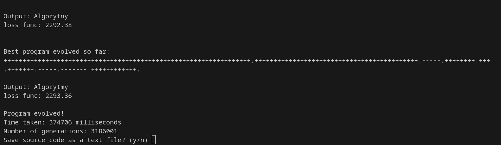

# BF Code Generation Using Genetic Programming

This project encompasses BF code generation using 
genetic algorithms.



# Setup
This is a regular cmake project. In the source directory:
```
mkdir build && cd build
```
```
cmake ..
```

and then
```
make 
```
or 
```
ninja
```

to launch simply
```
./build/exec/exec <desired output>
```
for example:
```
./build/exec/exec hello!
```
